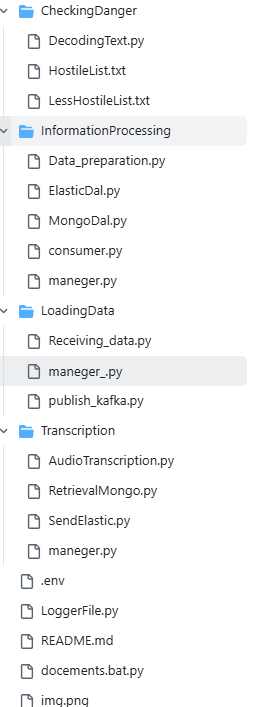
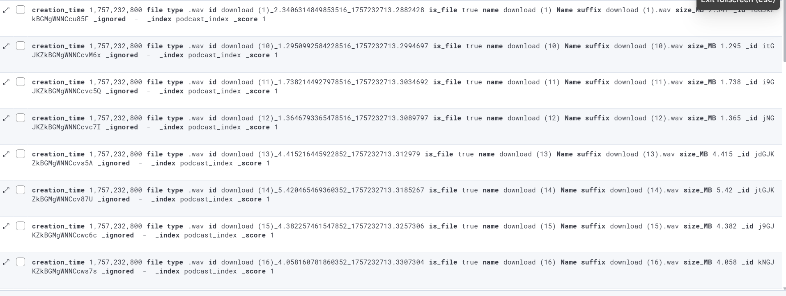

# TheMuezzin
## ברוכים הבאים למערכת TheMuezzin  

המערכת נועדה כדי להאזין לפודקאסטים לשלוף את מירב המידע לדוג', טקסט, עוין, וכ"ו כדי לדעת אם זה עוין לישראל, ולאחסנם ב DB שונים

### שלב א'

### תיקיית LoadingData

ראשית אנו מתחילים עם לשלוף מידע רלוונטי לנו מהפודקאסט באמצעות ספריית pathlib
מה שאנחנו שולפים זה, שם הקובץ, שם הקובץ כולל סיומת, סוג הקובץ, גודל הקובץ(MB), תאריך יצירה (שזה שניות מ 1970 ) 
ואחרי שיש לנו ג'יסון מוכן אנחנו שולחים אותו לקפקא כדי להשתמש עם זה בהמשך...

### שלב ב'

### תיקיית InformationProcessing

כעת אנו רוצים לשלוח את המידע לאלסטיק סרץ' ולמונגו, אז אנחנו מכינים את הדאטה ושולחים
ראשית אנו מייצרים ID משלנו כדי שנוכל לשייך את החלקי מידע שיש במונגו ובאלסטיק, שמורכב מהשם, גודל, ותאריך יצירה, בחרתי בזה כי מאוווד לא שכיח שיהיה קובץ עם אותם נתונים 
ולאחמ"כ שולחים לאלסטיק את כל המידע שהוצאנו עם הספריית pathlib בשלב א, וכולל את הנתיב המלא שלו, ואת ה ID היחודי 
ולמונגו אנו שולחים אם ID ואת הקובץ WAV עצמו באמצעות ספריית gridfs שמעלה את זה בביטים.

### שלב ג'

### תיקיית Transcription

כעת אנו רוצים לעדכן את אלסטיק עם התמלול של הפודקאסט, כדי שנוכל לסווג אותו בהמשך 
לכן אנו מתחילים בלשלוף ממונגו את הקובץ בביטים (למה לקחת ממונגו ולא מהלוקאל? כי אני לא יכול להסתמך על מה שיש לי על המחשב, כי בזמן הזה דברים יכולים להשתנות, וכן כי הוא לא יהיה גנרי מבחינת קוד, וכ"ו) באמצעות gridfs ושלחים את זה לספריית speech_recognition שמקבלת את מה ש IO ממירה מהביטים של מונגו, ו speech_recognition יודעת לתמלל,
ואז אנו שולחים את המלל לאלסטיק הקיים באמצעות המזהה ID שאנחנו בנינו, ומעדכנים שדה חדשה עם הטקסט 

# זה מבנה תיקיות שלי 

### כך נראה הKIBANE שלי 

כך בניתי אותו
docker run -d --name kibana `
  -p 5601:5601 `
  -e "ELASTICSEARCH_HOSTS=http://host.docker.internal:9200" `
  docker.elastic.co/kibana/kibana:8.15.0

